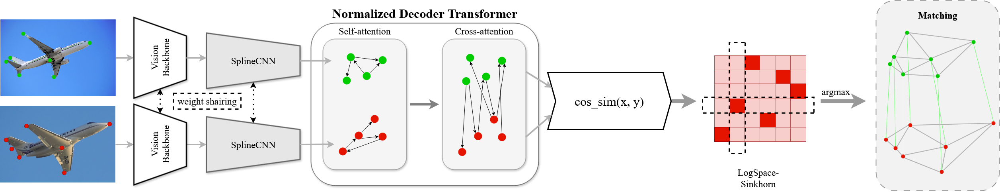
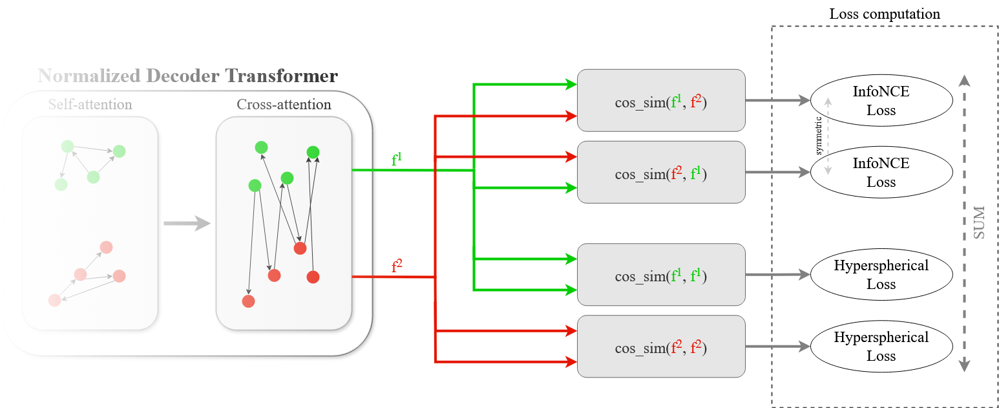

# NMT: Normalized Matching Transformer [(arxiv)]()
Normalized Matching Transformer (NMT) is an end-to-end deep learning pipeline that fuses a swin-transformer backbone, a SplineCNN for geometry-aware keypoint refinement, and a normalized transformer decoder with Sinkhorn matching and advanced contrastive/hyperspherical losses to achieve state-of-the-art sparse keypoint correspondence.




## Requirements
We use `CUDA 12.4` and `GCC 11.4.0`. All needed packages and libraries are in `environment.yml`.

## Installation
1. Entry PATH of your conda environment folder in the last line of the `environment.yml` file.
2. Entry the command: 
```bash 
conda env create -f environment.yml
```

## Usage

### Parameters
All Parameters are in the `experiments/` folder.

### Running Training / Evaluation
```bash
python -m torch.distributed.run --nproc_per_node=1 train_eval.py ./experiments/voc_basic.json
```
- `--nproc_per_node=1` sets how many GPU's you want to run the model.
- `./experiments/voc_basic.json` is which Parameter's and Dataset to use. Other option would be `./experiments/spair.json`.